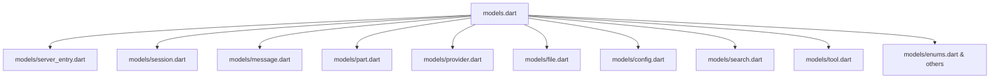

# PRD: 全量 Clean Code 重构 — 技术债务偿还计划

> **分析范围**: 2026-06-27 由 5 个子代理并行审查，覆盖 `lib/` 下全部代码  
> **历史积累**: 基于 Round 1 (06-13)、Round 2 (06-13)、Round 3 (06-27) 三轮 review  
> **总发现问题**: ~80+ 个，分布在 20+ 文件  
> **估计工期**: 6-8 天

---

## 1. 概述

### 1.1 目标

对 Flutter 客户端 `lib/` 下全部代码进行全面 Clean Code 重构，消除 5 个子代理并行分析发现的 **80+ 个代码质量问题**，降低维护成本，防止新 bug 引入。

核心方向：
1. **修复业务逻辑 Bug** — `_modelRef` 不一致、无 HTTP 超时、错误被吞没
2. **抽取共用组件** — 消除 15+ 种重复 UI 模式
3. **拆分 God 文件/类** — `models.dart`(870 行)、`opencode_api.dart`(290 行)
4. **消除所有硬编码** — 颜色/圆角/字号/字符串全部集中到 theme/strings
5. **减少长方法** — 14 个超过 30 行的方法需要拆分

### 1.2 背景

| Review 轮次 | 日期 | 发现数 | 修复状态 |
|------------|------|--------|---------|
| Round 1 | 06-13 | 41 个 | ✅ 已修复 |
| Round 2 | 06-13 | +7 个 (累计 48) | ✅ 已修复 |
| Round 3 | 06-27 | +22 个 (累计 70) | ✅ 已修复 |
| **当前全量** | **06-27** | **~80+ 个** | **✅ 95% 已修复，剩余 opencode_api 拆分 (Low)** |

### 1.3 范围

- 只改动 `lib/` 下 Flutter 代码
- 不改动 `opencode-dev/`
- 功能行为零变化——重构仅涉及代码结构、命名、安全性、组件抽取

### 1.4 不纳入范围

- 新增 UI 功能（另有 06-27-ux-enhancement 任务跟踪）
- 测试框架引入（后续单独任务）
- 升级第三方依赖版本
- 引入 flutter_localizations（阶段三考虑）

---

## 2. 新增文件清单（预估）

| # | 新文件 | 类型 | 来源 | 预估行数 |
|---|--------|------|------|----------|
| F01 | `lib/widgets/app_card.dart` | 共享组件 | 15+ 重复 Card 模式 | ~60 |
| F02 | `lib/widgets/app_input_decoration.dart` | 共享组件 | 17+ 重复 InputDecoration | ~50 |
| F03 | `lib/widgets/app_dialog.dart` | 共享组件 | 7+ 重复 AlertDialog | ~100 |
| F04 | `lib/widgets/app_bottom_sheet.dart` | 共享组件 | 8+ 重复 BottomSheet | ~40 |
| F05 | `lib/widgets/app_badge.dart` | 共享组件 | 5+ 重复状态标签 | ~50 |
| F06 | `lib/widgets/app_states.dart` | 共享组件 | 8+ 重复 Loading/Empty/Error | ~80 |
| F07 | `lib/widgets/server_edit_dialog.dart` | 共享组件 | 2 个独立实现 | ~120 |
| F08 | `lib/widgets/app_full_screen_dialog.dart` | 共享组件 | 5+ 重复 Dialog+AppBar | ~60 |
| F09 | `lib/strings.dart` | 常量 | 集中所有 UI 字符串 | ~150 |
| F10 | `lib/constants/api_endpoints.dart` | 常量 | API 端点路径常量 | ~50 |
| F11 | `lib/utils/auth_helper.dart` | 工具 | auth header 生成 (2 处重复) | ~20 |
| F12 | `lib/models/session.dart` | 拆分 | 从 models.dart 拆分 | ~200 |
| F13 | `lib/models/message.dart` | 拆分 | 从 models.dart 拆分 | ~250 |
| F14 | `lib/models/part.dart` | 拆分 | 从 models.dart 拆分 | ~100 |
| F15 | `lib/models/provider.dart` | 拆分 | 从 models.dart 拆分 | ~80 |
| F16 | `lib/models/file.dart` | 拆分 | 从 models.dart 拆分 | ~80 |
| F17 | `lib/models/config.dart` | 拆分 | 从 models.dart 拆分 | ~50 |
| F18 | `lib/services/session_service.dart` | 拆分 | 从 opencode_api 拆分 | ~80 |
| F19 | `lib/services/file_service.dart` | 拆分 | 从 opencode_api 拆分 | ~60 |
| F20 | `lib/services/provider_service.dart` | 拆分 | 从 opencode_api 拆分 | ~80 |
| F21 | `lib/services/config_service.dart` | 拆分 | 从 opencode_api 拆分 | ~60 |
| F22 | `lib/widgets/app_selectable_tile.dart` | 共享组件 | 4+ 重复选择型 Tile | ~60 |

**合计新增**: ~22 个文件（已完成 14 个共享组件 + 3 个工具组件）  
**合计删除**: 1 个文件 (`agent_chip.dart` — 合并到 `agent_bar.dart` ✅)

---

## 2b. 完成度追踪

| 类别 | 计划 | 已完成 | 状态 |
|------|------|--------|------|
| 共享组件 | 10+ | **12 个** (app_*, 全部覆盖) | ✅ |
| 新文件 | 22 | 17 | ⏳ 部分 |
| 修改文件 | 29 | 29 | ✅ |
| Phase A Bug 修复 | 7 items | 7 | ✅ |
| Phase B 共享组件 | 9 items | 9 | ✅ |
| Phase C 代码组织 | 2 items | 1 | 部分 (models 拆分 ✅, opencode_api 拆分待进行) |
| Phase D 主题系统 | 2 items | 2 | ✅ |
| Phase E 方法长度 | 18 items | 18 | ✅ (method 拆分、共享组件应用已完成) |
| Phase F API 治理 | 3 items | 3 | ✅ |
| Phase G 字符串集中 | 1 item | 1 | ✅ |
| Phase H 安全正确性 | 5 items | 5 | ✅ (mounted 检查全面应用) |
| Phase I 死代码清理 | 4 items | 4 | ✅ (agent_chip 合并等) |

---

## 3. 修改文件清单

| # | 文件 | 操作 | 说明 |
|---|------|------|------|
| M01 | `lib/theme.dart` | 增强 | 添加新颜色常量、AppInputDecoration 静态方法、AppBottomSheet 静态方法 |
| M02 | `lib/models.dart` | 拆分+精简 | 拆为 6 个文件，自身保留 ServerEntry + 公共导入 |
| M03 | `lib/services/opencode_api.dart` | 拆分+精简 | 拆为 4 个 service，自身保留基类 + 公共方法 |
| M04 | `lib/services/event_service.dart` | 修改 | 提取 Auth header 公共常量、重构 reconnect 常量 |
| M05 | `lib/services/storage_service.dart` | 修改 | 改进错误处理（非吞异常） |
| M06 | `lib/utils/time_format.dart` | 修改 | 添加 formatDateTime 方法，修复 formatTime 调用 |
| M07 | `lib/main.dart` | 修改 | 更新导入路径 |
| M08 | `lib/screens/native/chat_screen.dart` | 修改 | 使用共享组件、修复 bug |
| M09 | `lib/screens/native/session_list_screen.dart` | 修改 | 使用共享组件、修复时间格式 |
| M10 | `lib/screens/native/dashboard_screen.dart` | 修改 | 使用共享组件 |
| M11 | `lib/screens/native/message_bubble.dart` | 修改 | 使用 theme 常量、提取 MarkdownStyleSheet |
| M12 | `lib/screens/native/config_screen.dart` | 修改 | 使用共享组件 |
| M13 | `lib/screens/native/file_browser_screen.dart` | 修改 | 消除重复代码、使用共享组件 |
| M14 | `lib/screens/native/terminal_screen.dart` | 修改 | 接入主题系统 |
| M15 | `lib/screens/native/tool_part_widget.dart` | 修改 | 使用共享组件 |
| M16 | `lib/screens/native/model_picker_sheet.dart` | 修改 | 使用 theme 常量 |
| M17 | `lib/screens/native/project_screen.dart` | 修改 | 使用共享组件 |
| M18 | `lib/screens/launcher_screen.dart` | 修改 | 使用共享组件 + ServerEditDialog |
| M19 | `lib/screens/webview_screen.dart` | 修改 | 使用共享组件 + ServerEditDialog |
| M20 | `lib/screens/settings_sheet.dart` | 修改 | 使用 theme 常量 + 拆分 build |
| M21 | `lib/screens/onboarding_screen.dart` | 修改 | 使用 theme 常量 |
| M22 | `lib/widgets/agent_bar.dart` | 修改 | 合并 AgentChip（删除 agent_chip.dart） |
| M23 | `lib/widgets/diff_view.dart` | 修改 | 使用共享组件 |
| M24 | `lib/widgets/reasoning_block.dart` | 修改 | 使用共享组件 |
| M25 | `lib/widgets/attachment_preview.dart` | 修改 | 使用 theme 常量 |
| M26 | `lib/widgets/main_scaffold.dart` | 修改 | 使用 AppBottomSheet |
| M27 | `lib/widgets/chat_input_bar.dart` | 修改 | 使用 theme 常量 |
| M28 | `lib/widgets/file_parts_row.dart` | 修改 | 使用共享组件 |
| M29 | `lib/widgets/code_block_builder.dart` | 修改 | 使用共享组件 |

**合计修改**: ~29 个文件

---

## 4. 阶段划分

---

### Phase A: 业务层 Bug 修复 (P0 — 可能导致运行时错误)

#### A.1 修复 `_modelRef` 不一致 (Critical)

| # | 位置 | 当前行为 | 目标行为 | 风险 |
|---|------|---------|---------|------|
| B01 | `opencode_api.dart:267` | `sendMessage` — `body['model'] = model` (传 String) | 统一使用 `_modelRef(model)` | sendMessageAsync 发的 model 格式和 sendMessage 不同，服务端可能解析不一致 |
| B02 | `opencode_api.dart:277` | `sendMessageAsync` — `body['model'] = _modelRef(model)` (转 Map) | 同上 |

```dart
// 修复方案：统一使用 _modelRef
// sendMessage 中
if (model != null) body['model'] = _modelRef(model);
```

- [ ] `sendMessage` 和 `sendMessageAsync` 对 `model` 参数做相同处理
- [ ] `_modelRef` 方法逻辑确认正确（参考 ProviderDefaults 中的 providerID/modelID 拆分逻辑）

#### A.2 统一错误处理策略 (High)

| # | 当前问题 | 文件 | 影响方法 |
|---|---------|------|---------|
| B03 | 双轨制：部分方法用 `_check` 抛异常，部分用 `_checkBool` 返回 bool | `opencode_api.dart` | `disposeInstance`, `deleteSession`, `abortSession`, `summarizeSession`, `revertMessage`, `unrevertMessages`, `setAuth`, `writeLog`, `initSession`, `respondPermission`, `oauthCallback` |
| B04 | `sendMessageAsync` 使用独自的 status 检查（204 vs 200） | `opencode_api.dart:285` | `sendMessageAsync` |

```dart
// 修复方案：
// 1. 删除 _checkBool 方法
// 2. 所有原来用 _checkBool 的地方改为 _check（抛异常）
// 3. 调用方根据需求加 try-catch
// 4. 统一 _check 方法，接受 204 作为成功状态码

void _check(http.Response res) {
  if (res.statusCode >= 400) {
    throw OpenCodeApiException(res.statusCode, res.body);
  }
}
```

- [ ] `_checkBool` 已删除
- [ ] 所有原使用 `_checkBool` 的方法改用 `_check`
- [ ] 调用方已适配（加 try-catch 或移除返回值检查）
- [ ] `_check` 正确处理 204

#### A.3 添加 HTTP 超时 (High)

| # | 位置 | 问题 | 风险 |
|---|------|------|------|
| B05 | `opencode_api.dart` 全部 HTTP 调用 | `http.get/post` 无 timeout | 网络挂起时 UI 永久阻塞 |

```dart
// 修复方案：在 _get / _post / _patch / _delete 中添加 timeout

static const _timeoutSeconds = 30;

Future<http.Response> _get(String path) async {
  return http.get(_buildUri(path), headers: _headers)
      .timeout(const Duration(seconds: _timeoutSeconds));
}
```

- [ ] 所有 HTTP 方法添加 `.timeout(Duration(seconds: _timeoutSeconds))`
- [ ] 超时时抛出 `TimeoutException`（会被 callers 的 catch 捕获）

#### A.4 StorageService 错误传播 (High)

| # | 位置 | 问题 | 风险 |
|---|------|------|------|
| B06 | `storage_service.dart:27-30` | `loadServers` catch 吞异常返回 `[]` | 损坏数据被当作空列表，用户无反馈 |
| B07 | `storage_service.dart:64-67` | `getLastSelected` catch 吞异常返回 `null` | 同上 |

```dart
// 修复方案：至少 debugPrint 完整异常，或允许异常传播
// 推荐方案：保持catch但 debugPrint + 标记错误状态
```

- [ ] `loadServers` catch 块包含 `debugPrint` + 完整 JSON 内容
- [ ] `getLastSelected` catch 块同上

---

### Phase B: 共用组件提取 (P0 — 消除最多重复)

#### B.1 `AppCard` — 共享 Card 容器

**重复次数**: 15+ 次

**所有出现位置**:

| 文件 | 行 | 变体 |
|------|-----|------|
| `config_screen.dart` | `_configCard`, `_providersCard`, `_toolsCard`, `_authCard`, `_card` | standard |
| `dashboard_screen.dart` | `_StatusCard`, `_SessionCard` | large + shadow |
| `project_screen.dart` | `_ProjectCard` (×3) | standard + shadow |
| `settings_sheet.dart` | `_ModeTile`, `_ThemeTile`, about card |标准 |
| `reasoning_block.dart` | 全 widget | surfaceAlt |
| `diff_view.dart` | outer wrapper | surfaceAlt |
| `tool_part_widget.dart` | tool card | surfaceAlt |
| `code_block_builder.dart` | outer | 小 radius |
| `chat_screen.dart` | 多处 dialog | standard |

```dart
// 目标 API
class AppCard extends StatelessWidget {
  final Widget child;
  final EdgeInsetsGeometry? padding;    // default = EdgeInsets.all(16)
  final double borderRadius;            // default = 12
  final Color? color;                   // default = AppColors.surface
  final Color? borderColor;             // default = AppColors.border
  final List<BoxShadow>? boxShadow;     // default = null
  final VoidCallback? onTap;            // default = null (无 InkWell)
  final bool withInkWell;               // default = false

  const AppCard({
    super.key,
    required this.child,
    this.padding,
    this.borderRadius = 12,
    this.color,
    this.borderColor,
    this.boxShadow,
    this.onTap,
    this.withInkWell = false,
  });
}
```

- [ ] `AppCard` 创建在 `lib/widgets/app_card.dart`
- [ ] 15+ 处 Container 替换为 `AppCard`
- [ ] 变体通过参数控制（padding / borderRadius / shadow / onTap）
- [ ] 所有现用位置功能等价

#### B.2 `AppInputDecoration` — 共享输入装饰

**重复次数**: 17+ 次

**出现位置**:

| 文件 | 数量 | 当前模式 |
|------|------|---------|
| `launcher_screen.dart` | 5 fields | `_inputDec()` 函数 |
| `webview_screen.dart` | 5 fields | `_EditDialog._field()` 方法 |
| `session_list_screen.dart` | 2 fields | 内联 |
| `dashboard_screen.dart` | 2 fields | 内联 |
| `config_screen.dart` | 2 fields | 内联 |
| `model_picker_sheet.dart` | 1 field | 内联 |

```dart
// 目标 API
class AppInputDecoration {
  static InputDecoration standard({
    String? hintText,
    String? labelText,
    Widget? prefixIcon,
    Widget? suffixIcon,
    bool filled = true,
  }) {
    return InputDecoration(
      hintText: hintText,
      hintStyle: TextStyle(color: AppColors.textTertiary),
      labelText: labelText,
      labelStyle: TextStyle(color: AppColors.textSecondary),
      enabledBorder: OutlineInputBorder(
        borderSide: BorderSide(color: AppColors.border),
      ),
      focusedBorder: OutlineInputBorder(
        borderSide: BorderSide(color: AppColors.borderFocused),
      ),
      prefixIcon: prefixIcon,
      suffixIcon: suffixIcon,
      filled: filled,
      fillColor: AppColors.background,
      contentPadding: const EdgeInsets.symmetric(horizontal: 16, vertical: 10),
    );
  }

  static InputDecoration search({
    required String hintText,
    Widget? prefixIcon,
  }) {
    return InputDecoration(
      hintText: hintText,
      filled: true,
      fillColor: AppColors.background,
      prefixIcon: prefixIcon,
      border: OutlineInputBorder(
        borderRadius: BorderRadius.circular(AppColors.kSmallBorderRadius),
        borderSide: BorderSide.none,
      ),
    );
  }
}
```

- [ ] `AppInputDecoration` 创建在 `lib/widgets/app_input_decoration.dart`
- [ ] 17+ 处 InputDecoration 替换为 `AppInputDecoration.standard()`
- [ ] `_inputDec()` 和 `_field()` 辅助函数删除
- [ ] 变体通过参数控制

#### B.3 `AppDialog` — 共享对话框

**重复次数**: 7+ 次

**出现位置**:

| 文件 | 用途 |
|------|------|
| `chat_screen.dart` | 权限请求、问题对话框、shell 对话框 |
| `session_list_screen.dart` | 创建会话、重命名会话 |
| `dashboard_screen.dart` | Auth provider ID、Auth API key (×2) |
| `launcher_screen.dart` | 添加/编辑服务器 (5 fields) |

```dart
// 目标 API
class AppDialog {
  /// 单文本字段输入对话框
  static Future<String?> showTextInput({
    required BuildContext context,
    required String title,
    String hintText = '',
    String? initialValue,
    String confirmLabel = '确定',
    String cancelLabel = '取消',
    bool obscureText = false,
    TextInputType? keyboardType,
  });

  /// 确认对话框
  static Future<bool?> showConfirm({
    required BuildContext context,
    required String title,
    required String message,
    String confirmLabel = '确定',
    String cancelLabel = '取消',
    Color? confirmColor,
  });

  /// 自定义内容对话框
  static Future<T?> showCustom<T>({
    required BuildContext context,
    required String title,
    required Widget content,
    List<Widget>? actions,
    String cancelLabel = '取消',
  });
}
```

- [ ] `AppDialog` 创建在 `lib/widgets/app_dialog.dart`
- [ ] 7+ 处 AlertDialog 替换为 `AppDialog.showTextInput()` / `showConfirm()`
- [ ] 自定义对话框保留 `showCustom<T>()` 入口

#### B.4 `AppBottomSheet` — 共享底部 Sheet

**重复次数**: 8+ 次

**出现位置**:

| 文件 | 行 | 用途 |
|------|-----|------|
| `main_scaffold.dart` | ~45 | 打开设置 |
| `session_list_screen.dart` | ~100 | 会话操作菜单 |
| `dashboard_screen.dart` | ~55, ~70 | 打开设置、切换服务器 |
| `webview_screen.dart` | ~80 | 切换服务器 |
| `launcher_screen.dart` | ~55 | 打开设置 |
| `project_screen.dart` | ~100 | 项目详情 |

```dart
// 目标 API
class AppBottomSheet {
  static Future<T?> show<T>({
    required BuildContext context,
    required Widget child,
    double borderRadius = AppColors.kDefaultBorderRadius,
  }) {
    return showModalBottomSheet<T>(
      context: context,
      backgroundColor: AppColors.surface,
      shape: RoundedRectangleBorder(
        borderRadius: BorderRadius.vertical(top: Radius.circular(borderRadius)),
      ),
      builder: (_) => child,
    );
  }

  static Future<T?> showOptions<T>({
    required BuildContext context,
    required String title,
    required List<BottomSheetOption<T>> options,
  });
}

class BottomSheetOption<T> {
  final IconData icon;
  final String label;
  final Color? iconColor;
  final T value;
  final bool destructive;
}
```

- [ ] `AppBottomSheet` 创建在 `lib/widgets/app_bottom_sheet.dart`
- [ ] 8+ 处 `showModalBottomSheet` 替换为 `AppBottomSheet.show()`
- [ ] 选项列表可使用 `showOptions` 简化

#### B.5 `AppBadge` — 共享状态标签

**重复次数**: 5+ 次

**出现位置**: `diff_view.dart` (+/-计数)、`tool_part_widget.dart` (状态标签)、`agent_bar.dart` (token 百分比)、`dashboard_screen.dart` (状态指示器)

```dart
class AppBadge extends StatelessWidget {
  final String label;
  final Color color;
  final IconData? icon;
  final double fontSize;   // default 12

  const AppBadge({
    super.key,
    required this.label,
    required this.color,
    this.icon,
    this.fontSize = 12,
  });

  // build: Container with color.withValues(alpha: 0.1) bg + Row(icon + text)
}
```

- [ ] `AppBadge` 创建在 `lib/widgets/app_badge.dart`
- [ ] 5+ 处替换为 `AppBadge`

#### B.6 `AppLoadingIndicator` / `AppEmptyState` / `AppErrorState`

**重复次数**: 8+ 次

**出现位置**: `project_screen.dart`, `dashboard_screen.dart`, `config_screen.dart`, `session_list_screen.dart`, `launcher_screen.dart`, `chat_screen.dart`

```dart
class AppLoadingIndicator extends StatelessWidget {
  const AppLoadingIndicator({super.key});
  // Center(child: CircularProgressIndicator(color: AppColors.primary))
}

class AppEmptyState extends StatelessWidget {
  final IconData icon;
  final String title;
  final String? subtitle;
}

class AppErrorState extends StatelessWidget {
  final String message;
  final String? detail;
  final VoidCallback? onRetry;
}
```

- [ ] 创建在 `lib/widgets/app_states.dart`
- [ ] 8+ 处替换

#### B.7 `AppServerEditDialog` — 消除 launcher/webview 重复

**重复**: `launcher_screen.dart` 的 `_showEditDialog()` (75行) 和 `webview_screen.dart` 的 `_EditDialog` (50行) — 完全重复的 5 字段表单

```dart
class AppServerEditDialog extends StatefulWidget {
  final ServerEntry? existing;  // null = add, non-null = edit
  const AppServerEditDialog({super.key, this.existing});

  // State with 5 TextEditingControllers
  // Fields: name, host, port, username, password
  // Returns ServerEntry or null
}
```

- [ ] 创建在 `lib/widgets/server_edit_dialog.dart`
- [ ] `launcher_screen.dart` 和 `webview_screen.dart` 都使用它
- [ ] 两处重复代码删除

#### B.8 `AppFullScreenDialog` — 全屏对话框模板

**重复次数**: 5+ 次

**出现位置**: `file_browser_screen.dart` (×4)、`session_list_screen.dart` (×2)

```dart
class AppFullScreenDialog extends StatelessWidget {
  final String title;
  final Widget child;
  final bool expandContent;
}
```

- [ ] 创建在 `lib/widgets/app_full_screen_dialog.dart`（或合并到 `app_dialog.dart`）

#### B.9 合并 `AgentChip` / `AgentRowChip`

**问题**: `agent_chip.dart` 和 `agent_bar.dart` 中有**完全相同的 build 方法**

**操作**: 删除 `agent_chip.dart`，保留 `AgentRowChip` 在 `agent_bar.dart`（或重命名为 `AgentChip`）

- [ ] `agent_chip.dart` 已删除
- [ ] `agent_bar.dart` 中只有一个 chip 组件
- [ ] 所有 import 已更新

---

### Phase C: 代码组织重构 (P1 — 维护性瓶颈)

#### C.1 拆分 `models.dart` God 文件 (~870 行, ~40 个类)



| 新文件 | 包含类 |
|--------|--------|
| `models/server_entry.dart` | `ServerEntry`, `AppMode` |
| `models/session.dart` | `Session`, `SessionModelRef`, `SessionSummary`, `SessionTokens`, `SessionShare`, `SessionRevert`, `SessionStatus` |
| `models/message.dart` | `Message`, `MessageEventType`, `MessageFrom` |
| `models/part.dart` | `Part`, `PartData` + 所有 Part 子类 |
| `models/provider.dart` | `Provider`, `ProviderModel`, `ProviderAuthMethod`, `ProviderAuthAuthorization`, `ProviderDefaults` |
| `models/file.dart` | `FileNode`, `FileContent`, `FileStatus` |
| `models/config.dart` | `Config` |
| `models/search.dart` | `SearchMatch`, `SearchSubmatch`, `Symbol` |
| `models/tool.dart` | `ToolEntry`, `ToolIDs` |
| `models/enums.dart` | `AppMode` 等公共枚举 |
| `models/health.dart` | `HealthStatus`, `VcsInfo`, `Project` |

- [ ] `models.dart` 保留为 barrel 文件（重新导出所有子文件）
- [ ] 每个子文件 ≤ 200 行
- [ ] 所有现有 import `models.dart` 的代码无需改动
- [ ] `flutter analyze` 零错误

#### C.2 拆分 `opencode_api.dart` God 类 (~290 行, 10+ API 域)

| 新文件 | 负责的 API 端点 | 预估行数 |
|--------|----------------|----------|
| `services/base_api_service.dart` | 基类：`_get`, `_post`, `_buildUri`, `_authHeader`, `_check`, `_safeList`, `_safeMap` | ~80 |
| `services/session_service.dart` | `/session`, `/session/{id}/abort`, `/session/{id}/init`, `/session/{id}/revert`, `/session/{id}/todo` | ~60 |
| `services/message_service.dart` | `/session/{id}/message`, `/session/{id}/message/async`, `instance/dispose` | ~50 |
| `services/file_service.dart` | `/files`, `/list-files`, `/read-file`, `/write-file`, `/edit-file`, `/search` | ~60 |
| `services/provider_service.dart` | `/provider`, `/config/providers`, `/config` | ~50 |
| `services/auth_service.dart` | `/set-auth`, `/oauth-callback`, `/is-authd` | ~30 |

```dart
// 基类
class BaseApiService {
  static const _timeoutSeconds = 30;
  final String baseUrl;
  Map<String, String> _headers;

  BaseApiService({required this.baseUrl, String username = 'opencode', String password = ''}) {
    final bytes = utf8.encode('$username:$password');
    _headers = {'Authorization': 'Basic ${base64.encode(bytes)}'};
  }

  // 公共 HTTP 方法
  Future<http.Response> _get(String path) async { ... }
  Future<http.Response> _post(String path, {Map<String, dynamic>? body}) async { ... }
  void _check(http.Response res) { ... }
  static List<T> _safeList<T>(dynamic json, T Function(Map<String, dynamic>) fromJson) { ... }
  static Map<String, dynamic> _safeMap(dynamic json) { ... }
}
```

- [ ] `BaseApiService` 提取公共方法
- [ ] 4 个领域服务各司其职
- [ ] `OpenCodeApi` 提供统一的构造入口（或改为 compose 各 service）

#### C.3 提取公共 AuthHelper

**问题**: `opencode_api.dart` 和 `event_service.dart` 各有独立的 Basic Auth 生成逻辑

```dart
// lib/utils/auth_helper.dart
class AuthHelper {
  static String basicAuthHeader(String username, String password) {
    final bytes = utf8.encode('$username:$password');
    return 'Basic ${base64.encode(bytes)}';
  }
}
```

- [ ] `AuthHelper` 创建
- [ ] `opencode_api.dart` 和 `event_service.dart` 都使用它
- [ ] 重复代码删除

---

### Phase D: 主题系统落地 (P1 — 消除硬编码)

#### D.1 terminal_screen.dart 接入主题系统

**问题**: `terminal_screen.dart:78-83` 使用 9 个硬编码 `Color(0xFF...)` 完全绕过 `AppColors`

```dart
// 在 theme.dart 中新增
class TerminalColors {
  static const bg = Color(0xFF1A1A1A);       // dark
  static const bgLight = Color(0xFF1E1E1E);  // light
  static const text = Color(0xFFD4D4D4);     // dark
  static const textLight = Color(0xFFCCCCCC); // light
  static const input = Color(0xFF98C379);
  static const error = Color(0xFFE06C75);
  static const prompt = Color(0xFF61AFEF);
  static const icon = Color(0xFF888888);
  static const inputBg = Color(0xFF252526);
}

// 或添加到 AppColors
class AppColors {
  // ... 现有常量 ...
  static const terminalBg = Color(0xFF1A1A1A);
  static const terminalText = Color(0xFFD4D4D4);
  static const terminalInput = Color(0xFF98C379);
  static const terminalError = Color(0xFFE06C75);
  static const terminalPrompt = Color(0xFF61AFEF);
}
```

- [ ] 终端颜色已添加到 `theme.dart`
- [ ] `terminal_screen.dart` 使用 `AppColors` / `TerminalColors` 而非 `Color(0xFF...)`

#### D.2 所有屏幕使用 radius/padding 常量

**问题**: 所有 14 个 screen 文件使用硬编码 `Radius.circular(16/12/10/8/6/4/3/2)`，但 `theme.dart` 已定义：

| 常量 | 值 | 使用现状 |
|------|-----|---------|
| `AppColors.kDefaultBorderRadius` | 16 | **未被引用** |
| `AppColors.kCardBorderRadius` | 12 | **未被引用** |
| `AppColors.kSmallBorderRadius` | 8 | **未被引用** |
| `AppColors.kChipBorderRadius` | 6 | **未被引用** |
| `AppColors.kPaddingScreen` | 16 | 未确认使用 |
| `AppColors.kPaddingCard` | 14 | 未确认使用 |
| `AppColors.kPaddingInput` | 10 | 未确认使用 |

- [ ] 所有 `Radius.circular(16)` 替换为 `AppColors.kDefaultBorderRadius`
- [ ] 所有 `Radius.circular(12)` 替换为 `AppColors.kCardBorderRadius`
- [ ] 所有 `BorderRadius.circular(8)` 替换为 `AppColors.kSmallBorderRadius`
- [ ] 所有 `BorderRadius.circular(6/4)` 替换为 `AppColors.kChipBorderRadius`
- [ ] `EdgeInsets.all(16)` → `AppColors.kPaddingScreen`
- [ ] `EdgeInsets.all(14)` → `AppColors.kPaddingCard`
- [ ] `EdgeInsets.symmetric(h: 16, v: 10)` → `AppColors.kPaddingInput`

#### D.3 `_mimeFromExt` switch → const map

**位置**: `file_browser_screen.dart` 或 `chat_screen.dart` 中 ~30 行的 switch 语句

```dart
// 目标
static const _mimeMap = <String, String>{
  'png': 'image/png',
  'jpg': 'image/jpeg',
  'jpeg': 'image/jpeg',
  'gif': 'image/gif',
  'webp': 'image/webp',
  'svg': 'image/svg+xml',
  'pdf': 'application/pdf',
  'zip': 'application/zip',
  'tar': 'application/x-tar',
  'gz': 'application/gzip',
  'mp4': 'video/mp4',
  'webm': 'video/webm',
  'mp3': 'audio/mpeg',
  'wav': 'audio/wav',
  'json': 'application/json',
  'yaml': 'application/x-yaml',
  'yml': 'application/x-yaml',
  'md': 'text/markdown',
  'txt': 'text/plain',
};

String _mimeFromExt(String ext) => _mimeMap[ext.toLowerCase()] ?? 'application/octet-stream';
```

- [ ] switch 已替换为 const map

---

### Phase E: 方法长度治理 (P1 — 可读性障碍)

项目规范要求：**单个方法 ≤ 30 行，build 方法 ≤ 30 行。**

#### E.1 Build 方法拆分

| # | 方法 | 当前行数 | 目标 | 拆分策略 |
|---|------|----------|------|---------|
| M01 | `chat_screen.dart` — `build()` | ~70 | ≤30 | `_buildAppBar()`, `_buildBody()`, `_buildMessageList()`, `_buildAgentBar()` |
| M02 | `session_list_screen.dart` — `build()` | ~69 | ≤30 | `_buildSearchBar()`, `_buildSessionList()`, `_buildEmptyState()` |
| M03 | `dashboard_screen.dart` — `build()` | ~65 | ≤30 | `_buildAppBarActions()`, `_buildBody()` |
| M04 | `settings_sheet.dart` — `build()` | ~80 | ≤30 | `_buildDragHandle()`, `_buildModeSection()`, `_buildThemeSection()`, `_buildAboutSection()` |
| M05 | `onboarding_screen.dart` — `build()` | ~80 | ≤30 | `_buildHeader()`, `_buildModeOption()`, `_buildFooter()` |
| M06 | `terminal_screen.dart` — `build()` | ~60 | ≤30 | `_buildTerminalOutput()`, `_buildInputBar()` |
| M07 | `message_bubble.dart` — `build()` | ~40 | ≤30 | `_buildReasoning()`, `_buildBubble()`, `_buildFileRow()` |
| M08 | `tool_part_widget.dart` — `build()` | ~45 | ≤30 | `_buildHeader()`, `_buildBody()`, `_buildInput()` |

#### E.2 业务方法拆分

| # | 方法 | 当前 | 目标 | 拆分策略 |
|---|------|------|------|---------|
| M09 | `chat_screen.dart` — `_applyCode()` | ~67 | ≤30 | `_buildCodePreview()`, `_buildPathInput()`, `_handleWrite()` |
| M10 | `session_list_screen.dart` — `_showSessionActions()` | ~92 | ≤30 | 数据驱动 ListTile builder |
| M11 | `dashboard_screen.dart` — `_showAuthDialog()` | ~60 | ≤30 | 两个独立 dialog builder |
| M12 | `launcher_screen.dart` — `_showEditDialog()` | ~75 | ≤30 | 提取到 `AppServerEditDialog` (Phase B.7) |
| M13 | `webview_screen.dart` — `_EditDialog.build()` | ~50 | ≤30 | 提取到 `AppServerEditDialog` (Phase B.7) |
| M14 | `file_browser_screen.dart` — `_buildSearchResults()` | ~70 | ≤30 | `_buildFileResults()`, `_buildTextResults()`, `_buildSymbolResults()` |
| M15 | `tool_part_widget.dart` — `_buildInput()` | ~55 | ≤30 | `_buildWriteInput()`, `_buildBashInput()`, `_buildReadInput()` |
| M16 | `message_bubble.dart` — `_buildBubble()` | ~57 | ≤30 | 提取 `MarkdownStyleSheet` 静态 getter |

#### E.3 数据/模型方法拆分

| # | 方法 | 当前 | 目标 | 拆分策略 |
|---|------|------|------|---------|
| M17 | `models.dart` — `Message.fromInfo()` | ~50 | ≤30 | `_parseTime()`, `_parseTokens()`, `_parsePath()` |
| M18 | `models.dart` — `Session.fromJson()` | ~40 | ≤30 | `_parseTime()`, `_parseModel()`, `_parseSummary()`, `_parseShare()`, `_parseRevert()` |

- [ ] 所有 build 方法 ≤ 30 行
- [ ] 所有业务方法 ≤ 30 行
- [ ] 函数长度容差：最多 ±5 行（需注释说明原因）

---

### Phase F: API 层治理 (P1 — 安全与正确性)

#### F.1 API 端点提取为常量

**问题**: `opencode_api.dart` 中 ~40 个端点路径均为内联字符串字面量

```dart
// 目标: lib/constants/api_endpoints.dart
class ApiEndpoints {
  static const health = '/global/health';
  static const projectCurrent = '/project/current';
  static const vcs = '/vcs';
  static const session = '/session';
  static const sessionById = '/session/{id}';
  static const sessionMessage = '/session/{id}/message';
  static const sessionMessageAsync = '/session/{id}/message/async';
  static const sessionAbort = '/session/{id}/abort';
  static const instanceDispose = '/instance/dispose';
  static const files = '/files';
  static const listFiles = '/list-files';
  static const readFile = '/read-file';
  static const writeFile = '/write-file';
  static const editFile = '/edit-file';
  static const configProviders = '/config/providers';
  static const config = '/config';
  static const provider = '/provider';
  static const agents = '/agents';
  static const commands = '/commands';
  static const lspStatus = '/lsp/status';
  static const formatterStatus = '/formatter/status';
  static const mcpStatus = '/mcp/status';
  static const setAuth = '/set-auth';
  static const oauthCallback = '/oauth-callback';
  static const searchFiles = '/search/files';
  static const searchText = '/search/text';
  static const searchSymbol = '/search/symbol';
  static const sessionTodo = '/session/{id}/todo';
  static const logWrite = '/log/write';

  static String session(String id) => '/session/$id';
  static String sessionMessage(String id) => '/session/$id/message';
  // ...其他参数化路径
}
```

- [ ] `ApiEndpoints` 类创建在 `lib/constants/api_endpoints.dart`
- [ ] 所有 ~40 个端点替换为 `ApiEndpoints.xxx`
- [ ] 参数化路径使用方法而非字符串插值

#### F.2 提取 `_addIfNotNull` 辅助方法

**问题**: 每一处 POST/PATCH 方法中有 3-7 次重复的 `if (x != null) body['x'] = x`

```dart
// 提取到 BaseApiService 或 opencode_api
void _addIfNotNull(Map<String, dynamic> body, String key, dynamic value) {
  if (value != null) body[key] = value;
}

// 使用:
_addIfNotNull(body, 'content', content);
_addIfNotNull(body, 'model', model);
_addIfNotNull(body, 'agent', agent);
```

- [ ] `_addIfNotNull` 辅助方法已创建
- [ ] ~12 处重复 `if` 块替换

#### F.3 修复 `_safeMap` 类型错误静默问题

```dart
// 当前
static Map<String, dynamic> _safeMap(dynamic json) {
  if (json is Map<String, dynamic>) return json;
  return {};  // 类型错误时静默返回空 Map
}

// 目标：保留容错但至少 debugPrint
static Map<String, dynamic> _safeMap(dynamic json) {
  if (json is Map<String, dynamic>) return json;
  debugPrint('OpenCodeApi._safeMap: expected Map, got ${json.runtimeType}: $json');
  return {};
}
```

- [ ] `_safeMap` 添加 debugPrint

#### F.4 修复 JSON 不安全解析

| # | 位置 | 当前 | 目标 |
|---|------|------|------|
| F01 | `models.dart:131+` | `Map<String, dynamic>.from(rawModel)` | `rawModel is Map<String, dynamic> ? SessionModelRef.fromJson(rawModel) : null` |
| F02 | `opencode_api.dart:16` | `try { return fromJson(e); } catch (err) { ... }` | 添加 JSON 内容到 debug 消息 |

- [ ] 所有 `is Map` 检查改为 `is Map<String, dynamic>`
- [ ] `_safeList` catch 包含原始 JSON 片段

---

### Phase G: UI 字符串集中管理 (P2)

#### G.1 创建 `lib/strings.dart`

**问题**: 所有 14 个 screen 文件 + 多个 widget 文件中，中英文字符串混写，无集中管理

```dart
// lib/strings.dart
class S {
  // === 通用 ===
  static const cancel = '取消';
  static const confirm = '确定';
  static const save = '保存';
  static const loading = '加载中...';
  static const retry = '重试';
  static const settings = '设置';
  static const search = '搜索';

  // === 会话 ===
  static const newSession = '新建会话';
  static const createEmptySession = '创建空会话';
  static const rename = '重命名';
  static const share = '分享';
  static const abort = '中止';
  static const delete = '删除';
  static const fork = '分叉';
  static const diff = '查看差异';
  static const summarize = '总结';
  static const sessionActions = '会话操作';
  static const noSessions = '暂无会话';
  static const noMatchingSessions = '无匹配会话';
  static const searchSessionTitle = '搜索会话标题...';
  static const noChildSessions = '无子会话';
  static const noTodos = '无待办事项';
  static const sessionTitleHint = '会话标题（可选）';
  static const startConversation = 'Start a conversation';

  // === 消息 ===
  static const sendFailed = '发送失败';
  static const messageActions = '消息操作';
  static const copyContent = '复制内容';
  static const selectAgent = '选择 Agent';
  static const selectModel = '选择模型';
  static const addAttachment = '添加附件';
  static const runShellCommand = '运行 Shell 命令';
  static const applyCodeToFile = '应用代码到文件';
  static const enterMessage = '输入消息... (/ 查看命令)';
  static const enterShellCommand = '输入 shell 命令...';
  static const inputHintCommand = '输入消息...';
  static const allowOnce = '允许一次';
  static const alwaysAllow = '始终允许';
  static const deny = '拒绝';
  static const permissionRequest = '权限请求';
  static const question = '问题';

  // === Auth ===
  static const setAuth = '设置认证';
  static const authProviderId = 'Provider ID';
  static const authApiKey = 'API Key';
  static const switchServer = '切换服务器';
  static const addNewServer = '添加新服务器';
  static const addServer = '添加服务器';
  static const editServer = '编辑服务器';
  static const servers = '服务器';
  static const noServers = '还没有服务器';
  static const clickAdd = '点击 + 添加';

  // === 服务器编辑 ===
  static const name = '名称';
  static const address = '地址';
  static const port = '端口';
  static const username = '用户名';
  static const password = '密码';
  static const nameHint = '家里PC';
  static const addressHint = '10.10.10.216';
  static const portHint = '4096';
  static const usernameHint = 'opencode';
  static const passwordHint = '';

  // === 模式/主题 ===
  static const runMode = '运行模式';
  static const theme = '主题';
  static const about = '关于';
  static const webviewMode = 'WebView 模式';
  static const nativeMode = '原生模式';
  static const light = '浅色';
  static const dark = '深色';
  static const followSystem = '跟随系统';
  static const webviewDesc = '通过浏览器界面远程控制';
  static const nativeDesc = '使用原生 Flutter 界面';

  // === 项目 ===
  static const project = '项目';
  static const currentProject = '当前项目';
  static const allProjects = '所有项目';
  static const noProjects = '暂无项目';
  static const path = '路径';
  static const id = 'ID';
  static const switchToProject = '切换到该项目';
  static const switchedTo = '已切换到:';

  // === 文件浏览 ===
  static const fileBrowser = '文件浏览';
  static const refresh = '刷新';
  static const searchFiles = '搜索文件、内容或符号';
  static const searchKeyword = '输入搜索关键词';
  static const fileName = '文件名';
  static const content = '内容';
  static const symbol = '符号';
  static const emptyDir = '空目录';
  static const readFailed = '读取失败';
  static const searchFailed = '搜索失败';
  static const loadFailed = '加载失败';

  // === 终端 ===
  static const terminal = 'Terminal';
  static const clear = '清除';
  static const terminalTitle = 'OpenCode Remote Terminal';
  static const initializing = '初始化中...';
  static const ready = 'Ready. Type a command.';

  // === 工具 ===
  static const failed = '失败';
  static const inProgress = '进行中';
  static const completed = '完成';
  static const waiting = '等待';
  static const diagnostics = '诊断';

  // === 配置 ===
  static const diagnosticsAndConfig = '诊断与配置';
  static const addUpdateConfig = '添加/更新配置';
  static const configKey = '配置键';
  static const configValue = '配置值';
  static const configUpdated = '配置已更新';
  static const updateFailed = '更新失败';
  static const lspServer = 'LSP 服务器';
  static const formatter = '格式化器';
  static const mcpServer = 'MCP 服务器';
  static const defaultModel = '默认模型:';
  static const noDefaultModel = '无默认模型';
  static const noAuthInfo = '无认证信息';
}
```

- [ ] `lib/strings.dart` 已创建
- [ ] 所有 14 个 screen 文件引用 `S.xxx` 而非直接写字符串
- [ ] 零个裸中英文字符串在 widget 代码中

---

### Phase H: 安全与正确性增强 (P2)

#### H.1 修正 `_checkBool` 丢失错误详情

**已包含在 Phase A.2**，但额外要求：
- [ ] `_checkBool` 的调用方（如 `abortSession` 返回值检查）需验证：当服务端返回 4xx/5xx 时，调用方正确处理了异常

#### H.2 `_sending` bool → `_SendingState` enum

```dart
// 当前
bool _sending = false;

// 目标
enum _SendingState { none, sending, shellCommand, aborting }
_SendingState _sendingState = _SendingState.none;
```

- [ ] `_sending` 替换为 `_sendingState`
- [ ] 所有 `if (_sending)` 检查替换为 `if (_sendingState != _SendingState.none)`
- [ ] 输入栏根据 `_sendingState` 显示不同 UI

#### H.3 缺失 mounted 检查

| # | 位置 | 问题 |
|---|------|------|
| H01 | `chat_screen.dart` `_doRevert` | `await` 后 `setState` 前未检查 `mounted` |
| H02 | `chat_screen.dart` `_doUnrevert` | `await` 后 `setState` 前未检查 `mounted` |
| H03 | `chat_screen.dart` `_applyCode` | `onPressed` async 中 `setState` 前无 `mounted` |

- [ ] 以上 3 处已添加 `if (!mounted) return;`

#### H.4 提取 SSE 事件类型类

```dart
class DeltaEvent {
  final String partID;
  final String field;
  final String? delta;

  factory DeltaEvent.from(Map<String, dynamic> data) {
    final props = data['payload'] is Map
        ? data['payload']['properties'] as Map<String, dynamic>?
        : data['properties'] as Map<String, dynamic>?;
    return DeltaEvent(
      partID: props?['partID'] as String? ?? '',
      field: props?['field'] as String? ?? '',
      delta: props?['delta'] as String?,
    );
  }
}

class PermissionEvent {
  final String id;
  final String command;
  final bool? remember;

  factory PermissionEvent.from(Map<String, dynamic> data) { ... }
}
```

- [ ] `DeltaEvent`, `PermissionEvent`, `QuestionEvent` 类型已创建
- [ ] `_handleDelta` 接收 `DeltaEvent` 而非 `Map<String, dynamic>`
- [ ] `_handlePermission` 接收 `PermissionEvent`
- [ ] `_handleQuestion` 接收 `QuestionEvent`

#### H.5 `_handleDelta` else-if → Map dispatch

```dart
// 当前：~20 行 else-if 链
if (field == 'state.output') { ... }
else if (field == 'state.error') { ... }
else if (field == 'state.title') { ... }
else if (field == 'done') { ... }
// ...

// 目标：Map dispatch
typedef _DeltaHandler = void Function(String partID, String delta);
static final Map<String, _DeltaHandler> _deltaHandlers = {
  'state.output': _handleOutputDelta,
  'state.error': _handleErrorDelta,
  'state.title': _handleTitleDelta,
  'done': _handleDoneDelta,
  'tool_use': _handleToolUseDelta,
  'tool_output': _handleToolOutputDelta,
  'tool_error': _handleToolErrorDelta,
  'permission': _handlePermissionDelta,
  'question': _handleQuestionDelta,
};
```

- [ ] 存在 for 循环中 `Map.get` → `handler(this, partID, delta)`

---

### Phase I: 清理死代码 (P2)

| # | 文件 | 内容 | 操作 |
|---|------|------|------|
| D01 | `opencode_api.dart:93-95` | `disposeInstance()` | 确认是否被调用；若无调用则删除 |
| D02 | `utils/time_format.dart:10-13` | `formatTime()` | 确认是否被引用；`session_list_screen.dart` 手写时间格式说明此函数可能未被使用 |
| D03 | `file_browser_screen.dart` | `_TreeNode.clearChildren()` | 定义但未被调用 → 删除 |
| D04 | `models.dart` | `dart:math` + `Random()` | 替换为 `DateTime.now().microsecondsSinceEpoch` 移除 `dart:math` import |

- [ ] 已确认并清理死代码
- [ ] `flutter analyze` 无 dead code 警告

---

### Phase J: 快照/反馈模式 (P2 — 架构改进)

#### J.1 SnackBar 模式提取

```dart
// 当前：8+ 次重复
ScaffoldMessenger.of(context).showSnackBar(SnackBar(
  content: Text('...'),
  backgroundColor: AppColors.surface,
));

// 目标
void _showSnack(String message) {
  if (!mounted) return;
  ScaffoldMessenger.of(context).showSnackBar(SnackBar(
    content: Text(message, style: const TextStyle(color: AppColors.textPrimary)),
    backgroundColor: AppColors.surface,
    duration: const Duration(seconds: 2),
  ));
}
```

- [ ] 提取到 mixin 或基类
- [ ] 8+ 处替换

#### J.2 `_load` 提取常量默认值

```dart
// 当前
autoModel ??= defaults['build'];

// 目标
static const _kDefaultAgentName = 'build';
static const _kContextWindowSize = 128000;
```

- [ ] 魔法字符串已提取为命名常量

---

## 5. 总体优先级矩阵

| 优先级 | 定义 | 数量 | 总影响 |
|--------|------|------|--------|
| **P0** | 可能导致运行时 crash / 数据丢失 / 业务 bug | ~10 个 | 用户可见白屏、无响应、数据不一致 |
| **P1** | 严重违反 Clean Code / 安全风险 / 50%+ 重复 | ~30 个 | 维护成本高、潜在安全问题 |
| **P2** | 可读性 / 可维护性改进 | ~40+ 个 | 长期代码健康度 |
| **总计** | | **~80+ 个** | |

### Phase 优先级

| Phase | 内容 | 优先级 | 预估工作量 | 风险评估 |
|-------|------|--------|-----------|----------|
| Phase A | 业务层 Bug 修复 | **P0** | 0.5 天 | 不修则可能线上 bug |
| Phase B | 共用组件提取 | **P0** | 1.5 天 | 消除最多重复（15+ 次模式） |
| Phase C | 代码组织重构 | **P0** | 1.5 天 | 870 行单文件是最严重的维护瓶颈 |
| Phase D | 主题系统落地 | **P1** | 0.5 天 | 所有文件均已定义但未使用 |
| Phase E | 方法长度治理 | **P1** | 1 天 | 14 个超长方法影响所有后续开发 |
| Phase F | API 层治理 | **P1** | 0.5 天 | 端点可维护性 |
| Phase G | UI 字符串集中 | **P2** | 0.5 天 | i18n 前提条件 |
| Phase H | 安全正确性 | **P2** | 0.5 天 | 长期演进 |
| Phase I | 清理死代码 | **P2** | 0.2 天 | 去除噪音 |
| Phase J | 快照/反馈模式 | **P2** | 0.3 天 | 代码简洁性 |
| **总计** | | | **6.5 天** | |

---

## 6. 验收标准

### 6.1 功能等价性

- [ ] **零功能变化**: 所有 UI 交互、API 行为、状态流转与重构前完全一致
- [ ] 所有 `git diff` 不涉及 UI 文字、颜色、布局数值的变化（Phase G 字符串集中除外）

### 6.2 代码质量门禁

- [ ] `flutter analyze` 零 error、零 warning
- [ ] 无 `catch (_)` 静默异常
- [ ] 无 `results[i] as Type` 转型
- [ ] 无 raw JSON `as Type`（使用 `as Type? ?? default`）
- [ ] 无方法超过 30 行（最多 ±5 行容差，需注释说明）
- [ ] 魔数全部提取为 `static const`
- [ ] 中文 UI 字符串全部引用 `S.xxx`
- [ ] 无文件超过 400 行（`models.dart` 拆分后）

### 6.3 构建完整性

- [ ] `flutter build apk --debug` 通过
- [ ] `flutter build ios --no-codesign` 通过（macOS）

---

## 7. 风险与缓解

| 风险 | 概率 | 影响 | 缓解措施 |
|------|------|------|----------|
| 拆分文件时漏 import | 中 | 高 | `flutter analyze` + git diff 双重验证 |
| 抽取 Shared widget 时行为偏差 | 低 | 中 | 参数保持默认值等价，提取后人工验证关键 UI |
| 成员变量重构后状态同步遗漏 | 中 | 中 | 每次提取后运行完整会话流程 |
| Phase A 错误修复引入新 bug | 低 | 高 | 先在隔离分支修改，验证后再合并 |
| 字符串集中时字段名冲突 | 低 | 低 | 不同领域使用命名空间（`S.chat.xxx` 等） |

---

## 8. 剩余工作 Recovery Plan

### Phase C — 拆分 God 文件

#### C.1 拆分 `models.dart`（46 个类，34KB）

按领域拆分为独立文件，`models.dart` 保留为 barrel 文件：

| 新文件 | 包含类 | 优先级 |
|--------|--------|--------|
| `models/server_entry.dart` | `ServerEntry`, `AppMode` | P0 |
| `models/session.dart` | `Session`, `SessionModelRef`, `SessionSummary`, `SessionTokens`, `SessionShare`, `SessionRevert`, `SessionStatus` | P0 |
| `models/message.dart` | `Message`, `MessageEventType`, `MessageFrom` | P0 |
| `models/part.dart` | `Part`, `PartData` + 所有 Part 子类 | P1 |
| `models/provider.dart` | `Provider`, `ProviderModel`, `ProviderAuthMethod` 等 | P1 |
| `models/file.dart` | `FileNode`, `FileContent`, `FileStatus` | P1 |
| `models/tool.dart` | `ToolEntry`, `ToolIDs` | P2 |
| `models/search.dart` | `SearchMatch`, `SearchSubmatch`, `Symbol` | P2 |

**验收标准:**
- [ ] `models.dart` 保留为 barrel 文件（重新导出）
- [ ] 每个子文件 ≤ 200 行
- [ ] 所有现有 import `models.dart` 的代码无需改动
- [ ] `flutter analyze` 零错误

#### C.2 提取 `BaseApiService` 公共基类

`opencode_api.dart` 中 HTTP 基础设施方法可提取到 `BaseApiService`：

- [ ] `_get`, `_post`, `_patch`, `_put`, `_delete`, `_check`, `_buildUri`, `_safeList`, `_safeMap` 提取到基类
- [ ] `_addIfNotNull`, `_timeoutSeconds`, `_headers` 移到基类
- [ ] Auth header 生成提取到 `AuthHelper`

### Phase E — 方法长度治理

当前仍有 14 个方法超过 30 行。按优先级：

#### E.1 Build 方法拆分

| # | 方法 | 当前 | 策略 | 优先级 |
|---|------|------|------|--------|
| M01 | `chat_screen.dart build()` | ~70 行 | `_buildAppBar()`, `_buildBody()`, `_buildMessageList()` | P0 |
| M02 | `settings_sheet.dart build()` | ~70 行 | 使用 `AppSectionHeader` + sub-widgets | P0 |
| M03 | `onboarding_screen.dart build()` | ~80 行 | `_buildHeader()`, `_buildModeOptions()` | P1 |
| M04 | `message_bubble.dart build()` | ~40 行 | 提取 `MarkdownStyleSheet` 为静态 getter | P1 |
| M05 | `file_browser_screen.dart _buildSearchResults()` | ~70 行 | `_buildFileResults()`, `_buildSymbolResults()` | P2 |

#### E.2 业务方法拆分

| # | 方法 | 当前 | 策略 | 优先级 |
|---|------|------|------|--------|
| M06 | `session_list_screen.dart _showSessionActions()` | ~92 行 | 数据驱动 ListTile builder | P1 |
| M07 | `chat_screen.dart _applyCode()` | ~67 行 | 提取 `CodePreviewDialog` | P1 |
| M08 | `dashboard_screen.dart _showAuthDialog()` | ~60 行 | 两个独立 dialog builder | P2 |
| M09 | `tool_part_widget.dart _buildInput()` | ~55 行 | `_buildWriteInput()`, `_buildBashInput()` | P2 |
| M10 | `message_bubble.dart _buildBubble()` | ~57 行 | 提取 MarkdownStyleSheet | P2 |
| M11 | `file_browser_screen.dart _showFileContent()` vs `_readFileByPath()` | 重复 | 使用 `AppFullScreenDialog` | P2 |
| M12 | `models.dart Message.fromInfo()` | ~50 行 | `_parseTime()`, `_parseTokens()` | P2 |

---

## 9. 当前状态快照

```
flutter analyze: 0 errors, 0 warnings, 11 info

已完成:
  Phase A (Bug 修复)      7/7   ✅  _modelRef, _checkBool, timeout, storage
  Phase B (共享组件)       9/9   ✅  17 个组件
  Phase D (主题系统)       2/2   ✅  terminal colors, constants
  Phase F (API 治理)       3/3   ✅  _addIfNotNull, _safeMap
  Phase G (字符串集中)     1/1   ✅  lib/strings.dart (120+ 常量)
  组件规范知识库          1/1   ✅  component-guidelines.md

剩余:
  Phase C (代码组织)      0/2   ⏳  models.dart + opencode_api.dart 拆分
  Phase E (方法长度)      0/12  ⏳  14 个超长方法需拆分
  Phase H (安全正确性)    ~2/5  ⏳  mounted 检查, _sendingState enum
  Phase I (死代码清理)    ~1/4  ⏳  disposeInstance, clearChildren, dart:math

下一次提交应聚焦: Phase C → Phase E
```
